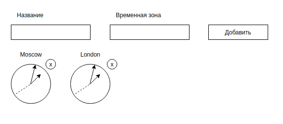
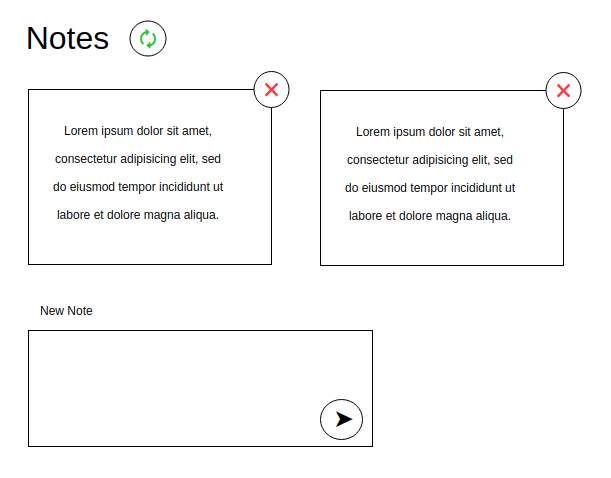

<a name="top"></a>

# 6. Домашнее задание к лекции «Жизненный цикл и работа с HTTP»

[](https://ci.appveyor.com/project/AlexRemar/Homework-RA6-Lifecycle) [[GithubPages](https://AlexRemar.github.io/Homework-RA6-Lifecycle)]

---

**Перейти к:**  
***[6.2 CRUD](#6.2)  

---

## 6.1 Мировые часы

Наверняка вы видели в офисах многих компаний, установленные часы, показывающие время в разных столицах мира:
* New York
* Moscow
* London
* Tokyo 

И т.д.



Общая механика:

1. Вы заполняете поля название и временная зона (указываете смещение в часах относительно Гринвича) и нажимаете кнопку "Добавить"
1. Часы автоматически добавляются и (что самое важное) часы начинают "тикать", т.е. отсчитываются секунды, минуты и часы
1. При нажатии на крестик рядом с часами часы автоматически удаляются, при этом все подписки (`setTimeout`, `setInterval` и другие) должны вычищаться в соответствующем методе жизненного цикла

Упрощения: если вам сложно реализовать механику со стрелками (через css - см. `transform` и `rotate()`), то вы можете сделать цифровые часы, где отображаются только цифры в формате: ЧЧ:ММ:СС

Подсказки:
1. Посмотреть текущий TimezoneOffset вы можете используя объект `Date`
1. Можете использовать библиотеку momentjs.

---

## <a name="6.2">6.2 CRUD</a>
***[(наверх)](#top)***

Вам необходимо реализовать базовый CRUD (без обновления) при работе с HTTP.

Backend вы можете либо написать сами, либо взять готовый (из каталога `backend`).



## Общая механика

Первоначальная загрузка: делается http-запрос GET на адрес http://localhost:7777/notes, полученные данные отображаются в виде карточек с возможностью удаления

Добавление:
1. Вы заполняете форму и нажимаете кнопку "Добавить"
1. Выполняется http-запрос POST на адрес http://localhost:7777/notes, в теле запроса передаётся следующий JSON:
```json
{
    "id": 0,
    "content": "То, что было введно в поле ввода"
}
```
3. После чего делается запрос на получение всех записей и происходит обновление списка (GET http://localhost:7777/notes).

Удаление:
1. Вы нажимаете на крестик на одной из карточек
1. Выполняется http-запрос DELETE на адрес http://localhost:7777/notes/{id} (где id - это идентификатор заметки)
1. После чего делается запрос на получение всех записей и происходит обновление списка (GET http://localhost:7777/notes).

Обновление:
1. Вы нажимаете на кнопку обновить (две зелёные стрелочки)
1. После чего делается запрос на получение всех записей и происходит обновление списка (GET http://localhost:7777/notes).

---
